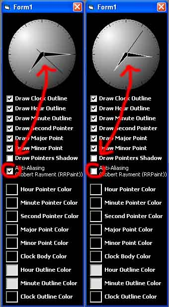



## Gradient Cool Clock \(updated with Anti\-Aliasing\)

### Description

Graphical gradient clock
 
### More Info
 

             |
---                |---
**Submitted On**   |2007-03-23 14:31:56
**By**             |[Batavian X](https://github.com/Planet-Source-Code/PSCIndex/blob/master/ByAuthor/batavian-x.md)
**Level**          |Intermediate
**User Rating**    |4.8 (19 globes from 4 users)
**Compatibility**  |VB 6\.0
**Category**       |[OLE/ COM/ DCOM/ Active\-X](https://github.com/Planet-Source-Code/PSCIndex/blob/master/ByCategory/ole-com-dcom-active-x__1-29.md)
**World**          |[Visual Basic](https://github.com/Planet-Source-Code/PSCIndex/blob/master/ByWorld/visual-basic.md)
**Archive File**   |[Gradient\_C2055663232007\.zip](https://github.com/Planet-Source-Code/batavian-x-gradient-cool-clock-updated-with-anti-aliasing__1-68120/archive/master.zip)

